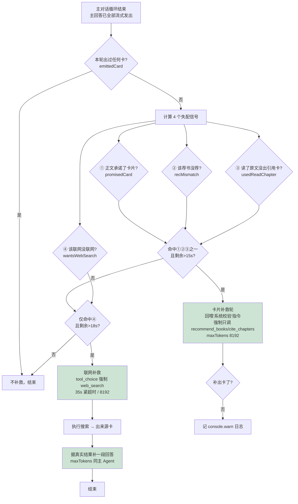

# 智学 Agent「小涤」工具触发兜底策略

> 解决的问题：工具调用走 `tool_choice=auto`（模型自己决定调不调），M3 在长 system / 长上下文下会偶发**「嘴上说、手不动」**——说"这就帮你查"却不调 web_search、正文推荐了《馆藏书》却不出卡、读了原文却不给引用卡、问天气直接凭印象编。提示词只能降低概率、压不到 0，所以加一套**确定性的代码兜底**。
>
> 核心思路：**工具有没有被真正调用，前端是能客观知道的（出没出卡片事件）。** 于是在「模型答完之后」做一次客观核对，发现"该出的没出"就用代码强制补一轮——不依赖模型自觉。
>
> 主要实现：`app/api/chat/route.ts` 的 `runAgent()`；渲染兜底在 `components/chat/ChatMessage.tsx`。

---

## 一、整体五道关卡

| 关卡 | 时机 | 作用 | 代码位置 |
|---|---|---|---|
| **0 预防** | 生成前 | 提示词铁律 + 工具描述写明触发条件 + 注入当前日期 | `lib/server/agent.ts`、`lib/server/tools.ts` |
| **1a 轮次/预算耗尽保护** | 主循环每轮 | 没轮次/没时间了仍强制执行"出卡"工具，其余丢弃 | `route.ts` `runAgent` 循环 |
| **1b 工具结果诚实回喂** | 工具执行后 | 失败时返回"别假装出卡，请重试或如实说"，逼模型不撒谎 | `lib/server/tools.ts` `execTool` |
| **2 答完失配补救**（核心） | 主回答结束后 | 客观核对"该出没出"，命中就强制补一轮（卡片轮 / 联网轮，互斥） | `route.ts` `runAgent` 末尾 |
| **3 前端兜底渲染** | 渲染时 | 有卡数据但正文无占位标记 → 把卡渲染在气泡末尾，卡不丢 | `ChatMessage.tsx` |

---

## 二、决策流程图

> 关键：卡片补救与联网补救是 **`if / else if` 互斥**——一轮最多补一类。

---

## 三、第 1 层：循环内实时兜底

主循环每轮：模型产出 → 有工具调用就执行并回喂结果 → 直到纯文本收尾。两个兜底点：

1. **轮次/预算耗尽保护**（`round >= MAX_ROUNDS(8)` 或 `剩余 < 12s`）：模型还在调工具但已没轮次/没时间，**仍强制执行 `recommend_books` / `cite_chapters` 这两个"出卡"工具**（正文可能已说"为你推荐如下"，卡片是用户唯一点击入口），其余工具丢弃。
2. **工具结果诚实回喂**：工具失败时返回的不是空，而是 **"失败：这些 id 馆藏里没有……若不重试，正文中不得提及卡片"**——逼模型要么换正确 id 重试、要么别假装卡片已出现。

---

## 四、第 2 层：答完后的「失配检测 + 补救轮」（最关键）

### 4.1 核对用的客观信号（整轮累计）

| 变量 | 含义 |
|---|---|
| `emittedCard` | 本轮**出过任何卡**吗（荐书 recs / 引用 cites / 联网 web） |
| `usedWebSearch` | **真联网**过吗 |
| `usedReadChapter` | **真读过**章节原文吗（且非失败/幻觉章号） |
| `fullText` | 模型说出来的**全部正文** |
| `lastRaw` | 模型**最后说的原话**（用来回喂"你刚才说过的话"） |

### 4.2 四个「该触发却没触发」信号

| 信号 | 判定逻辑 | 抓的失信 |
|---|---|---|
| ① **promisedCard** | 正文出现"已为你展示卡片/下方卡片/这张卡"等承诺语 **却没出卡** | 说了卡却没卡（最严重） |
| ② **recMismatch** | 用户有荐书意图（推荐/什么书/哪本…） **且** 正文出现《馆藏书名》 **却没出卡** | 推荐了书却没给可点卡片 |
| ③ **usedReadChapter** | 真调 `read_chapter` 读原文作答 **却没调** `cite_chapters` | 用了原文却不能跳转 |
| ④ **wantsWebSearch** | 用户明确要联网（联网/上网/查最新） **或** 问时效事实（今天天气/最新新闻/股价…） **却没联网** | 该搜没搜 / 凭印象编 |

### 4.3 补救动作（互斥，一轮最多补一类）

**A. 卡片补救**（命中 ①②③ 之一，且 `剩余 > 15s`）
- 回喂模型刚说的话 + 一条「**系统校验**」指令（按命中的信号给不同措辞），要求"立即调用 recommend_books/cite_chapters，**只调工具、不要输出文字**"。
- `maxTokens = 8192`（M3 的 `<think>` 也吃预算，过小会"思考没想完就烧光、工具没吐出来"）。
- 期间给用户「**正在为你整理相关书目与章节**」状态，消除"答完又卡住"观感。

**B. 联网补救**（仅命中 ④，且 `剩余 > 18s`）
1. `tool_choice` **强制本轮必调 `web_search`**（35s 紧超时、8192）；
2. 执行搜索 → 出「联网搜索·参考 N 篇」来源卡；
3. 再用**和主 Agent 一样大的 maxTokens** 让模型**据真实搜索结果补一段回答**。
4. 全程 `try/catch` + 紧超时：补救失败只记日志，**绝不影响已发出的回答（不会把 200 变 502）**。

---

## 五、防误触发 / 防滥用的设计细节

| 约束 | 为什么 |
|---|---|
| **互斥 + `!emittedCard` 前置** | 已出过任意卡就不补——避免"今天天气不错，推荐本书"（已出荐书卡）还硬塞个天气搜索 |
| **预算门槛**（15s / 18s / 12s） | 补救轮 M3 思考要十几秒，时间不够就不补，免得跑一半被平台硬杀=白烧 token |
| ① 只匹配"承诺展示卡片"语境 | **不泛匹配"卡片"二字**，否则聊"卡片笔记法"会误触发 |
| ③ 只在 read_chapter **真拿到原文**才置位 | 防模型用幻觉章号连续失败也触发补救 |
| ④ 时效正则要求**时间词紧贴事实名词** | 避免"今天天气不错，推荐本书"误判去联网 |
| **诚实回喂**（"系统校验"身份） | 不伪装成用户说的话，只客观提醒模型"你说了卡却没出/你没真搜" |

---

## 六、关键阈值速查

| 项 | 值 | 含义 |
|---|---|---|
| `MAX_ROUNDS` | 8 | 主循环最多轮次（防失控） |
| 整请求时间预算 | 105s | `deadline`，每轮超时取剩余 |
| 卡片补救门槛 | 剩余 > 15s | 不够则跳过 |
| 联网补救门槛 | 剩余 > 18s | 不够则跳过 |
| 联网补救·搜索轮超时 | min(35s, 剩余) | 挂起也快速失败 |
| 主 Agent / 联网作答轮 maxTokens | 20000（后台可调） | 含 `<think>` 预算 |
| 卡片补救 / 联网搜索轮 maxTokens | 8192 | 给足 think 空间 |

> 主 Agent maxTokens、温度等可在 `/admin/agent`「③ 参数配置」在线调整（本地生效；线上文件系统只读，改完需提交上线）。

---

## 七、实测验证

- **正常模式**：`今天贵州天气` 连续测 → 联网来源卡 **5/5** 出现（主循环搜到就出、编了就被兜底补）。
- **极端模式**（用测试钩子 `CHAT_TEST_NO_MAIN_WEBSEARCH=1` 把主循环的 web_search **整个拿掉**，逼出"编造"）：`今天贵州天气` / 旅游攻略 → 联网兜底仍 **8/8** 强制补搜成功（连模型自己说"我没有联网工具"都被兜回来）。
- **荐书 / 章节解读**：`recs` / `cites` 卡片稳定触发。

---

## 八、兜底也兜不住的情况（局限）

- 补救轮**模型仍不调/调错** → 放弃，记 `console.warn` 供排查（五道关卡已尽力）；
- 信号是正则/启发式，**罕见措辞**仍可能漏判或误判；
- **联网补救会产生"双段回答"**（原编造段 + 补救真实段）——为纠正而接受的小代价，且**只在模型编造时才发生**；
- 时间预算不够时**主动跳过**补救（长回答后窗口放不下）。

---

## 九、一句话总结

> 模型自觉（提示词）→ 循环内保命（轮次耗尽也出卡）→ 答完客观核对（4 信号）→ 强制补一轮（卡片轮 / 联网轮）→ 前端兜底渲染——**五道关卡把"该触发没触发"压到极低**。
